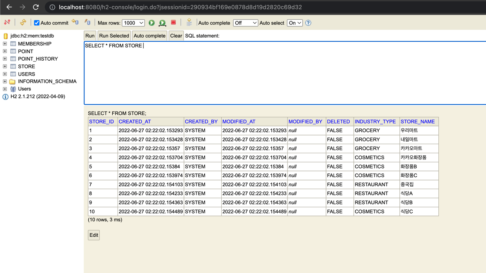
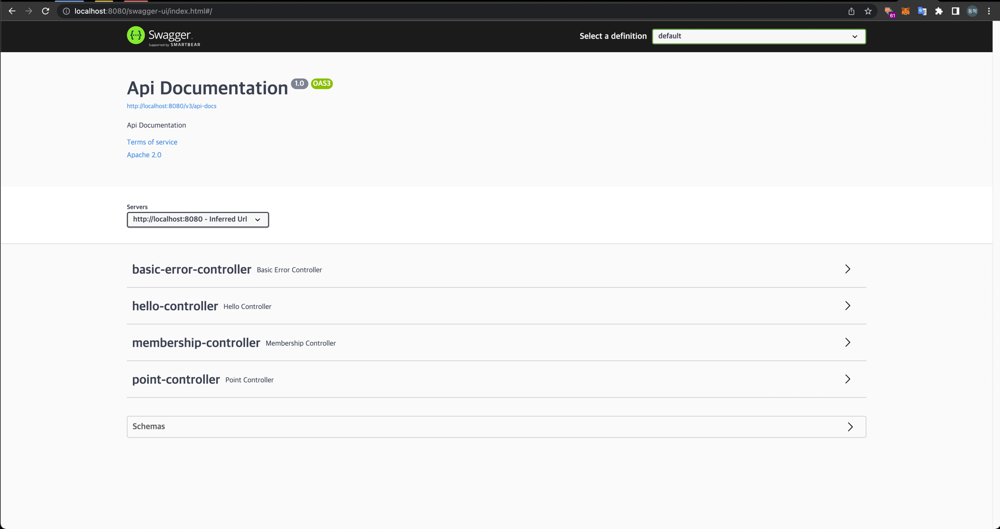
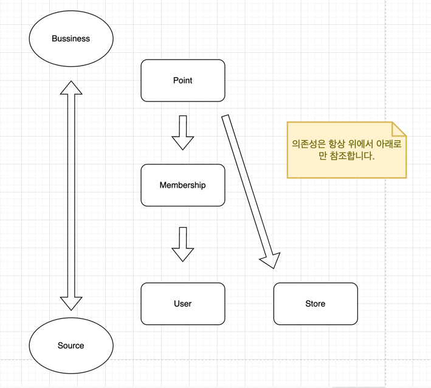

## 상세 스펙

```text
Java : 11
Spring boot : 2.7.0
H2 Database : 2.1.212
ORM : JPA
```

## 실행 방법

```text
vm options : -Dspring.profiles.active=local

1. KakaoPayApiApplication 실행
2. http://localhost:8080/h2-console/login.jsp 으로 접속, 로그인 (username: sa, password: <없음>)
3. http://localhost:8080/swagger-ui/index.html 으로 접속, 테스트
```



## 설계 내용의 이유

```text
설계시 주의 했던 점
1. 서비스 확장성
2. 순환되는 의존성을 피하고 비지니스별로 계층 구조를 갖게함
 
[서비스 확장성]
User, Store, Membership, Point가 각각 다른 라이프 사이클을 갖고 있고 서로 다른 비지니스 로직을 갖고 있다고 생각했습니다.
그래서 MSA로 확장될 걸 고려해서 Service Layer에서 서로 의존성을 갖는 걸을 최대한 피했고
Application이라는 레이어를 두어서 서로 이 레이어에서만 의존성을 갖도록 설계했습니다.

[순환되는 의존성을 피하고 비지니스별로 계층 구조를 갖게함]
그리고 제 생각에 User와 Store는 비지니스 로직과는 거리가 멀지만 원천 데이터 소스에 가깝다고 생각했습니다.
Membership은 위의 두 개보다 좀 더 비지니스로직에 가깝다고 생각했습니다. 
그리고 Memebership 서비스는 User 서비스를 의존해야만 한다고 생각했습니다.
Point는 가장 비지니스 로직과 가깝고 원천 데이터들과는 멀다고 생각했습니다.
```



